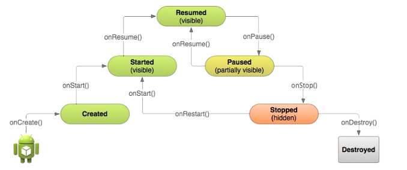

# Activity Lifecycle and Managing State

---

## 1. Introduction to the Activity Lifecycle (Exam Core Concept)

The **Activity Lifecycle** is the set of states an Activity transitions through from the moment it is instantiated in memory by the Android system until it is completely destroyed and its resources reclaimed by the operating system.

As users navigate into, out of, and back to your application screens, Activity instances transition through different states managed by the Android framework.

### Why Lifecycle Management Matters:
1. Prevents app crashes when incoming phone calls or dialogs interrupt an active activity.
2. Prevents memory leaks by releasing unused system resources (GPS, camera, sensors).
3. Preserves user progress/state across **Device Configuration Changes** (e.g., screen orientation rotation).
4. Conserves device battery power when the user switches to another application.

---

## 2. Activity Lifecycle State Diagram

Below is the official Activity Lifecycle state transition diagram:



---

## 3. Detailed Lifecycle Callback Methods (10-Mark Exam Breakdown)

Every Activity class overrides specific lifecycle callback methods to manage hardware resources and UI state.

### 1. `onCreate(Bundle savedInstanceState)`
- **Trigger**: Called when the Activity is first instantiated by the system.
- **State**: Transits to **Created** state (transient).
- **Execution Frequency**: Executed **ONLY ONCE** in an activity's lifetime.
- **Developer Responsibilities**:
  - Perform static setup logic (inflate UI via `setContentView(R.layout.activity_main)`).
  - Bind Java object variables to XML views via `findViewById()`.
  - Restore saved instance state data from the `savedInstanceState` `Bundle`.
  - Initialize background tasks and class-scoped variables.

---

### 2. `onStart()`
- **Trigger**: Called when the activity is about to become visible on the screen.
- **State**: Transits to **Started** state (transient).
- **Execution Frequency**: May be called multiple times as the user navigates back to the activity.
- **Developer Responsibilities**:
  - Re-register hardware receivers or sensors (e.g., GPS, accelerometer, broadcast listeners) released in `onStop()`.
  - Prepare UI elements to become visible. (Note: User *cannot* interact with the screen yet in this state).

---

### 3. `onResume()`
- **Trigger**: Called just before the activity comes to the foreground and gains user focus.
- **State**: Transits to **Resumed / Running** state.
- **Execution Frequency**: Called multiple times (whenever coming back from `onPause()`).
- **Developer Responsibilities**:
  - Start on-screen animations, camera preview streams, or audio playback.
  - Resume exclusive interactive hardware services.
  - *This is the state where the user actively interacts with the app.*

---

### 4. `onPause()`
- **Trigger**: Called when another activity gains focus or overlays the screen (e.g., dialog pop-up, incoming phone call, or split-screen mode).
- **State**: Transits to **Paused** state.
- **Developer Responsibilities**:
  - Pause animations, video streams, or camera previews.
  - Release hardware-intensive resources (GPS, sensors) to save battery.
  - Commit unsaved volatile user input (e.g., draft messages).
  - *Rule*: Code inside `onPause()` **must execute extremely fast**. Do not perform heavy CPU operations (like writing to a SQLite database) here, as it delays navigation to the next screen.

---

### 5. `onStop()`
- **Trigger**: Called when the activity is **no longer completely visible** on screen (e.g., user pressed Home button or launched a new full-screen activity).
- **State**: Transits to **Stopped** state.
- **Developer Responsibilities**:
  - Perform heavy data-saving operations (write persistent data to database or Shared Preferences).
  - Release remaining heavy network or system resources.
  - *Note*: Stopped activity instances remain preserved in the Back Stack in RAM. However, if system RAM is depleted, the OS Low Memory Killer (LMK) may terminate the hosting process directly without executing further code.

---

### 6. `onRestart()`
- **Trigger**: Called when a stopped activity is about to be started again (before `onStart()`).
- **State**: Transits from **Stopped** $\rightarrow$ **Restarted** (transient) $\rightarrow$ **Started**.
- **Developer Responsibilities**:
  - Perform specific reload actions required only when returning from a stopped state.

---

### 7. `onDestroy()`
- **Trigger**: Called before the activity instance is completely destroyed and reclaimed from RAM memory.
- **State**: Transits to **Destroyed** state.
- **Triggers**:
  1. User presses Back button or calls `finish()` programmatically.
  2. System reclaims memory under extreme resource pressure.
  3. **Device Configuration Change occurs** (e.g., Screen Rotation).
- **Developer Responsibilities**:
  - Perform final cleanup: stop background worker threads, release remaining memory references to prevent memory leaks.

---

## 4. Device Configuration Changes & Activity Recreation

A **Configuration Change** occurs at runtime when device hardware state changes, invalidating current layouts or assets.

### Primary Triggers:
1. **Screen Rotation** (Portrait $\leftrightarrow$ Landscape orientation change).
2. **System Language / Locale Change**.
3. **Entering Multi-Window / Split-Screen Mode** (Android 7.0+ API 24).

### System Lifecycle Behavior During Configuration Change:
When a configuration change occurs (e.g., user rotates the screen), Android **shuts down and destroys the current activity instance**, then immediately **recreates a brand new instance** to load alternative resources matching the new configuration (`layout-land/`).

```
[Screen Rotated]
       │
       ▼
1. onPause() ──> 2. onStop() ──> 3. onSaveInstanceState(Bundle) ──> 4. onDestroy()
       │
       ▼  (Activity Instance Destroyed & New Instance Created)
       │
5. onCreate(Bundle) ──> 6. onStart() ──> 7. onRestoreInstanceState(Bundle) ──> 8. onResume()
```

---

## 5. Preserving User State: Activity Instance State (`Bundle`)

When an activity is recreated due to screen rotation or system memory reclamation, its temporary in-memory variable state is lost unless explicitly saved.

### Automatic Default State Restoration:
- Views with a unique `android:id` attribute (such as `EditText` text fields) **automatically save and restore their state** across rotation.
- Unidentified views (missing `android:id`) lose their state upon rotation.

---

### Managing Custom State via `onSaveInstanceState()` & `onRestoreInstanceState()`

#### 1. Saving Custom State (`onSaveInstanceState`)
Called automatically before `onStop()` when the user is leaving the activity. You populate the passed `Bundle` with key-value pairs.

```java
@Override
protected void onSaveInstanceState(Bundle outState) {
    super.onSaveInstanceState(outState); // Mandatory: saves View tree state
    
    // Save custom primitive variables to the Instance State Bundle
    outState.putInt("KEY_SCORE", mCurrentScore);
    outState.putInt("KEY_LEVEL", mCurrentLevel);
}
```

#### 2. Restoring Custom State (`onCreate` or `onRestoreInstanceState`)

State can be restored in `onCreate()` by checking if the `savedInstanceState` `Bundle` is non-null (a `null` bundle indicates a fresh app launch).

```java
@Override
protected void onCreate(Bundle savedInstanceState) {
    super.onCreate(savedInstanceState); // Mandatory
    setContentView(R.layout.activity_main);

    // Check if activity is being recreated after rotation/destruction
    if (savedInstanceState != null) {
        // Restore saved values using keys
        mCurrentScore = savedInstanceState.getInt("KEY_SCORE");
        mCurrentLevel = savedInstanceState.getInt("KEY_LEVEL");
    } else {
        // Initialize default values for a brand-new activity session
        mCurrentScore = 0;
        mCurrentLevel = 1;
    }
}
```

Alternatively, state can be restored inside `onRestoreInstanceState()`, which is called after `onStart()`:

```java
@Override
protected void onRestoreInstanceState(Bundle savedInstanceState) {
    super.onRestoreInstanceState(savedInstanceState); // Mandatory
    
    mCurrentScore = savedInstanceState.getInt("KEY_SCORE");
    mCurrentLevel = savedInstanceState.getInt("KEY_LEVEL");
}
```

---

## 6. Complete Executable Java Example: Lifecycle & Instance State Tracking

```java
package com.example.android.lifecycledemo;

import android.os.Bundle;
import android.support.v7.app.AppCompatActivity;
import android.util.Log;
import android.view.View;
import android.widget.TextView;

public class MainActivity extends AppCompatActivity {

    private static final String LOG_TAG = MainActivity.class.getSimpleName();
    private static final String KEY_COUNTER = "key_counter";

    private int mCount = 0;
    private TextView mShowCount;

    @Override
    protected void onCreate(Bundle savedInstanceState) {
        super.onCreate(savedInstanceState);
        setContentView(R.layout.activity_main);
        Log.d(LOG_TAG, "onCreate() executed");

        mShowCount = (TextView) findViewById(R.id.text_counter);

        // Restore counter value across screen rotation
        if (savedInstanceState != null) {
            mCount = savedInstanceState.getInt(KEY_COUNTER, 0);
            if (mShowCount != null) {
                mShowCount.setText(Integer.toString(mCount));
            }
        }
    }

    public void countUp(View view) {
        mCount++;
        if (mShowCount != null) {
            mShowCount.setText(Integer.toString(mCount));
        }
    }

    @Override
    protected void onSaveInstanceState(Bundle outState) {
        super.onSaveInstanceState(outState);
        Log.d(LOG_TAG, "onSaveInstanceState() saving count: " + mCount);
        outState.putInt(KEY_COUNTER, mCount);
    }

    @Override
    protected void onStart() {
        super.onStart();
        Log.d(LOG_TAG, "onStart() executed");
    }

    @Override
    protected void onResume() {
        super.onResume();
        Log.d(LOG_TAG, "onResume() executed");
    }

    @Override
    protected void onPause() {
        super.onPause();
        Log.d(LOG_TAG, "onPause() executed");
    }

    @Override
    protected void onStop() {
        super.onStop();
        Log.d(LOG_TAG, "onStop() executed");
    }

    @Override
    protected void onRestart() {
        super.onRestart();
        Log.d(LOG_TAG, "onRestart() executed");
    }

    @Override
    protected void onDestroy() {
        super.onDestroy();
        Log.d(LOG_TAG, "onDestroy() executed");
    }
}
```
