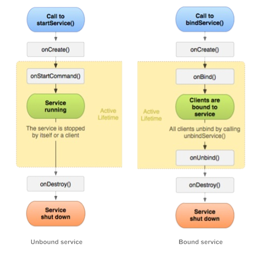

# Services, Task Scheduling & Notifications

---

## SECTION 1: Services & The 3 Types of Services

A **Service** is an application component that performs long-running operations in the background without providing a user interface (UI).

> [!IMPORTANT]
> **Threading Rule**: A Service runs on the **Main (UI) Thread** of its hosting process by default. It does NOT automatically spawn its own thread. Heavy CPU or blocking I/O work inside a Service MUST be offloaded to a separate worker thread to avoid ANRs.

---

### The 3 Core Types of Services (Exam Core 10-Mark Question)

```
                               TYPES OF ANDROID SERVICES
                                           |
        +----------------------------------+----------------------------------+
        |                                  |                                  |
        v                                  v                                  v
 FOREGROUND SERVICE                 STARTED SERVICE                    BOUND SERVICE
(User is actively aware;           (Runs indefinitely in             (Client-Server IPC;
 requires ongoing Notification)    background via startService())    binds via bindService())
```



| Service Type           | Trigger Method                                    | User Visibility                                                                   | Lifecycle & Termination                                                                                 | Primary Use Cases                                                          |
| :--------------------- | :------------------------------------------------ | :-------------------------------------------------------------------------------- | :------------------------------------------------------------------------------------------------------ | :------------------------------------------------------------------------- |
| **Foreground Service** | `startForegroundService()` or `startForeground()` | **Highly Visible**: Requires an ongoing, non-dismissible Status Bar Notification. | High OS priority. Will NOT be killed under low memory. Stopped via `stopForeground()` / `stopSelf()`.   | Music players, navigation routing, active workout tracking.                |
| **Started Service**    | `startService(intent)`                            | **Invisible**: Operates in the background.                                        | Runs indefinitely even if launcher activity is destroyed. Stopped via `stopSelf()` or `stopService()`.  | Background file download/upload, sync tasks.                               |
| **Bound Service**      | `bindService(intent, connection, flags)`          | **Invisible / Component-Bound**: Provides a client-server IPC interface.          | Lives ONLY as long as at least one application component is bound to it. Unbinds via `unbindService()`. | Inter-process communication (IPC), background data streaming to active UI. |

---

### 1. Declaring Services in `AndroidManifest.xml`

```xml
<application ...>
    <!-- Declare service and restrict access from external apps -->
    <service
        android:name=".MyBackgroundService"
        android:exported="false" />
</application>
```

---

### 2. `IntentService` (Simplified Started Service Subclass)

`IntentService` is a specialized subclass of `Service` designed for handling asynchronous tasks off the main thread:

- Automatically creates a dedicated **worker thread** (`HandlerThread`) to process intents.
- Creates a **Work Queue** passing one intent at a time to `onHandleIntent(Intent)`.
- Automatically calls `stopSelf()` when all queued intents are processed.

```java
public class FileDownloadIntentService extends IntentService {

    public FileDownloadIntentService() {
        super("FileDownloadWorkerThread"); // Name worker thread
    }

    // Executed automatically on worker thread (NOT main thread)
    @Override
    protected void onHandleIntent(Intent intent) {
        String fileUrl = intent.getStringExtra("file_url");
        // Perform heavy network download here safely
    }
}
```

---

### 3. Service Lifecycle Matrix: Started vs. Bound Services (Exam 6-Mark Diagram Question)

```
        STARTED SERVICE LIFECYCLE                   BOUND SERVICE LIFECYCLE
                 |                                             |
             onCreate()                                    onCreate()
                 |                                             |
          onStartCommand()                                  onBind()
                 |                                             |
         [Service Running]                             [Client Connected]
                 |                                             |
            stopSelf()                                     onUnbind()
                 |                                             |
            onDestroy()                                   onDestroy()
```

---

## SECTION 2: Scheduling & Optimizing Background Tasks

Android limits unconstrained background services to preserve battery and RAM. Modern background scheduling relies on intelligent job schedulers.

---

### 1. Task Schedulers Comparison Matrix

| Scheduler          | API Requirement            | Best Use Case                                            | Key Execution Features                                                                                       |
| :----------------- | :------------------------- | :------------------------------------------------------- | :----------------------------------------------------------------------------------------------------------- |
| **`JobScheduler`** | API 21+ (Android 5.0)      | Batch background jobs under specific device constraints. | Batches execution based on criteria: `NETWORK_TYPE_UNMETERED`, `REQUIRES_CHARGING`, `REQUIRES_DEVICE_IDLE`.  |
| **`AlarmManager`** | API 1+                     | Time-based reminders or exact alarms.                    | Triggers intents at exact clock times (e.g. 7:00 AM alarm clock). Wakes device up from sleep (`RTC_WAKEUP`). |
| **`WorkManager`**  | AndroidX (Modern Standard) | Deferrable, guaranteed background execution.             | Recommended replacement for all background scheduling; handles API compatibility automatically.              |

---

### 2. Implementing `JobScheduler` (`JobService`)

```java
public class MyJobService extends JobService {

    @Override
    public boolean onStartJob(JobParameters params) {
        System.out.println("Job Started");
        jobFinished(params,false);
        return true;
    }

    @Override
    public boolean onStopJob(JobParameters params) {
        return true;

    }
}

// 2. Schedule Job in Activity using JobInfo.Builder
JobScheduler scheduler = (JobScheduler) getSystemService(JOB_SCHEDULER_SERVICE);
ComponentName componentName = new ComponentName(this, MyNotificationJobService.class);

JobInfo jobInfo = new JobInfo.Builder(101, componentName)
        .setRequiredNetworkType(JobInfo.NETWORK_TYPE_UNMETERED) // Only Wi-Fi
        .setRequiresCharging(true)                            // Only plugged in
        .setPeriodic(15 * 60 * 1000)                          // Run every 15 mins
        .build();

scheduler.schedule(jobInfo);
```

---

## SECTION 3: System Notifications (`NotificationCompat`)

A **Notification** is a message displayed to the user outside your application's normal UI in the Status Bar, Notification Drawer, and Lock Screen.

---

### 1. Core Anatomical Components of a Notification

- **Small Icon**: Mandatory (`setSmallIcon()`).
- **Title Text**: Short headline (`setContentTitle()`).
- **Content Text**: Detail body string (`setContentText()`).
- **Content Intent**: `PendingIntent` triggered when user taps the notification.

---

### 2. Notification Channels (Mandatory for Android 8.0 / API 26+)

Starting in API 26, all notifications MUST be assigned to a **Notification Channel**. Channels allow users to customize notification settings (sound, vibration, importance) per channel in device settings.

```java
public void createNotificationChannel() {
    if (Build.VERSION.SDK_INT >= Build.VERSION_CODES.O) {
        NotificationChannel channel = new NotificationChannel(
            "PRIMARY_CHANNEL_ID",
            "News Updates",
            NotificationManager.IMPORTANCE_DEFAULT
        );
        channel.setDescription("Notifications for daily breaking news.");
        channel.enableVibration(true);

        NotificationManager notificationManager = getSystemService(NotificationManager.class);
        if (notificationManager != null) {
            notificationManager.createNotificationChannel(channel);
        }
    }
}
```

---

### 3. `PendingIntent` & Constructing Notifications (`NotificationCompat.Builder`)

A **`PendingIntent`** is a token wrapper giving the Android System permission to execute a contained `Intent` on behalf of your app at a later time (even if your app process is killed).

```java
public void sendNotification() {
    // 1. Explicit Intent for target Activity
    Intent intent = new Intent(this, MainActivity.class);
    PendingIntent pendingIntent = PendingIntent.getActivity(
        this,
        0,
        intent,
        PendingIntent.FLAG_UPDATE_CURRENT
    );

    // 2. Build Notification using NotificationCompat.Builder
    NotificationCompat.Builder builder = new NotificationCompat.Builder(this, "PRIMARY_CHANNEL_ID")
            .setSmallIcon(R.drawable.ic_notification)
            .setContentTitle("New Message Received")
            .setContentText("You have 1 unread message in your inbox.")
            .setContentIntent(pendingIntent) // Tap action
            .setAutoCancel(true)            // Dismisses notification on tap
            .setPriority(NotificationCompat.PRIORITY_HIGH);

    // 3. Issue Notification via NotificationManager
    NotificationManagerCompat notificationManager = NotificationManagerCompat.from(this);
    notificationManager.notify(1001 /* Notification ID */, builder.build());
}
```

---

### 4. Expanded Styles & Action Buttons

- **`BigTextStyle`**: Displays multi-line expanded body text (`.setStyle(new NotificationCompat.BigTextStyle().bigText("..."))`).
- **`BigPictureStyle`**: Displays an expanded image attachment.
- **Notification Action Buttons**: Add interactive buttons using `.addAction(icon, "Button Title", actionPendingIntent)`.
